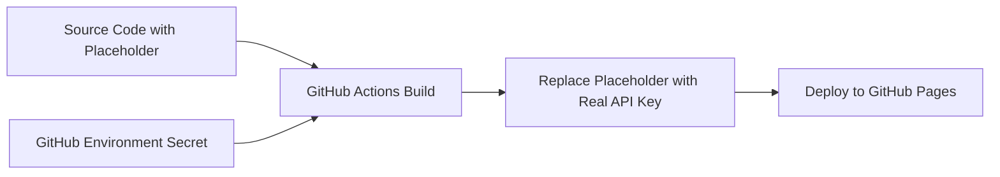

# API Key Security Implementation

This document explains how API keys are securely managed in this project.

## Problem

Previously, the GROQ API key was hardcoded directly in the `script.js` file:

```javascript
const GROQ_API_KEY = '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';
```

This exposed the API key to anyone who could view the source code, creating a security vulnerability.

## Solution

We implemented a build-time injection system using GitHub Actions and environment secrets:

### 1. Placeholder in Source Code

The source code now contains a placeholder instead of the actual API key:

```javascript
const GROQ_API_KEY = '{{GROQ_API_KEY}}';
```

### 2. GitHub Environment Secret

The actual API key is stored as a GitHub environment secret named `GROQ_API_KEY` in the `github-pages` environment.

### 3. Build-Time Replacement

During the GitHub Actions build process:

1. The build process reads the `GROQ_API_KEY` secret
2. It replaces all instances of `{{GROQ_API_KEY}}` with the actual API key
3. The built files (with the real API key) are deployed to GitHub Pages
4. The source code in the repository never contains the actual API key

## Security Benefits

1. **Source Code Protection**: The API key never appears in the source code
2. **Version Control Safety**: No risk of committing the API key to git history
3. **Access Control**: Only users with repository access to environment secrets can view/modify the API key
4. **Environment Isolation**: Different environments can use different API keys
5. **Audit Trail**: GitHub tracks who accesses environment secrets

## Workflow Process



## Setup Instructions

To set up the environment secret:

1. Go to repository **Settings** → **Environments**
2. Create/edit the `github-pages` environment
3. Add secret named `GROQ_API_KEY`
4. Set the value to your actual GROQ API key
5. Save the secret

## Local Development

For local development, use the provided `dev-setup.sh` script:

```bash
export GROQ_API_KEY='your-api-key-here'
./dev-setup.sh
```

This creates a local build with the API key injected for testing purposes.

## Files Modified

- `script.js`: Replaced hardcoded API key with placeholder
- `.github/workflows/deploy.yml`: Added GitHub Actions workflow
- `.gitignore`: Added build directories to ignore list
- `README.md`: Added setup documentation
- `dev-setup.sh`: Added local development script